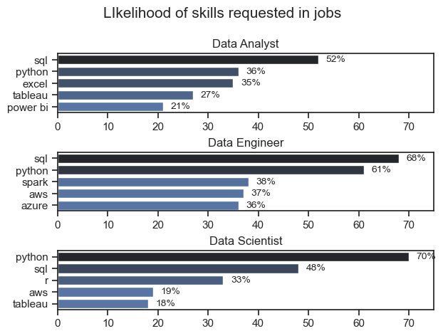
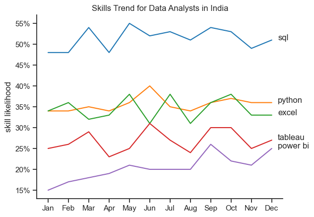
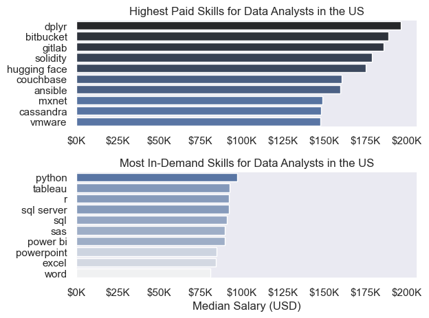
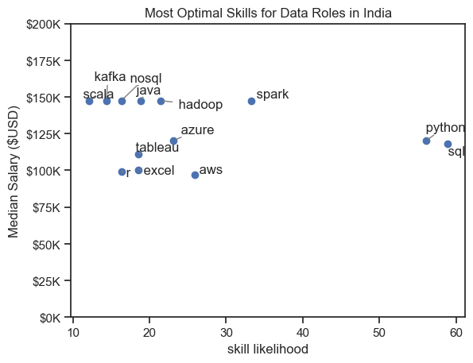
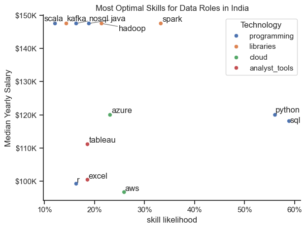

### 📊 Overview

This project explores the **data job market**, with a focus on **data roles**. I wanted to better understand which skills are most valuable and which jobs pay the best — and help others do the same.

Using [Luke Barousse's Data Jobs Dataset](https://huggingface.co/datasets/lukebarousse/data_jobs), I looked at job titles, salaries, locations, and required skills. With the help of Python, I answered questions like:

- What skills are companies looking for most?
- Which roles offer the highest salaries?
- Where do demand and salary meet for the best opportunities?

If you're aiming for a job in data — or just curious about the field — this analysis offers a clear picture of where the opportunities are.

### ✨ The Questions

These are the key questions I set out to answer in this project:

1. **Which skills are most in demand** for the top 3 data job roles?
2. **Which skills are becoming more popular** over time in data jobs?
3. **Which jobs and skills pay the best** in the data field?
4. **What are the best skills to learn** — the ones that are both high in demand and high in salary?

### 🧰 Tools I Used

To explore the data analyst job market, I used a set of powerful tools:

- **Python:** The core of my analysis — used to clean, explore, and analyze the data.
  - **Pandas:** For working with and analyzing data.
  - **Matplotlib & Seaborn:** To create clear and insightful visualizations.
- **Visual Studio Code:** My main code editor for writing and testing Python scripts.
- **Git & GitHub:** Used for version control and sharing my project online.

### 🧹 Data Preparation

Before diving into the analysis, I cleaned and organized the data to make sure everything was accurate and ready to use.

#### 🔍 Step 1: Import Libraries & Load Data

I started by importing the tools and loading the dataset.

```python
# Importing libraries
import pandas as pd
import seaborn as sns
import matplotlib.pyplot as plt
import ast
from datasets import load_dataset

# Loading the dataset
dataset = load_dataset('lukebarousse/data_jobs')
df = dataset['train'].to_pandas()
```

#### 🧼 Step 2: Clean the Data

I did some basic cleanup like fixing date formats and converting skills from strings to lists.

```python
# Convert date column to datetime format
df['job_posted_date'] = pd.to_datetime(df['job_posted_date'])

# Convert job_skills from string to list
df['job_skills'] = df['job_skills'].apply(lambda x: ast.literal_eval(x) if pd.notna(x) else x)
```

### Filter India Jobs

To focus on the Indian job market, I filtered the dataset to include only jobs based in **India**. This helped narrow down the analysis to relevant roles.

```python
df_US = df[df['job_country'] == 'India']

```

# The Analysis

Each Jupyter notebook for this project aimed at investigating specific aspects of the data job market. Here’s how I approached each question:

## 1. What are the most demanded skills for the top 3 most popular data roles?

To find the most demanded skills for the top 3 most popular data roles. I filtered out those positions by which ones were the most popular, and got the top 5 skills for these top 3 roles. This query highlights the most popular job titles and their top skills, showing which skills I should pay attention to depending on the role I'm targeting. 

View my notebook with detailed steps here: [2_Skill_Demand](project/2_skill_demand.ipynb).

### Visualize Data

```python
fig, ax = plt.subplots(len(job_titles),1)
sns.set_theme(style='ticks')

for i, job_title in enumerate(job_titles):
    df_plot = df_skills_percent[df_skills_percent['job_title_short'] == job_title].head(5)
    sns.barplot(data=df_plot,x = 'skill_percent',y = 'job_skills',ax = ax[i],hue = 'skill_percent',palette='dark:b_r')
    ax[i].set_title(job_title)
    ax[i].legend().set_visible(False)
    ax[i].set_ylabel("")
    ax[i].set_xlabel("")
    ax[i].set_xlim(0,75)

    for n, val in enumerate(df_plot['skill_percent']):
        ax[i].text(val + 1.5, n , f"{round(val)}%",va = 'center',fontsize = 10)
    


fig.suptitle('LIkelihood of skills requested in jobs',fontsize = 15)
fig.tight_layout(h_pad=0.5)
plt.show()
```

### Results



*Bar graph visualizing the salary for the top 3 data roles and their top 5 skills associated with each.*

# Insights: Skills in Demand for Data Roles

## 🔍 Top Skills by Role

### **Data Analyst**
- **SQL** (52%) is the most in-demand skill.
- **Python**, **Excel**, and **Tableau** follow closely.
- **Power BI** is less commonly required but still valuable.

### **Data Engineer**
- **SQL** (68%) and **Python** (61%) dominate.
- Tools like **Spark**, **AWS**, and **Azure** are also important (around 36–38%).

### **Data Scientist**
- **Python** (70%) is the top skill.
- **SQL** (48%) and **R** (33%) are also useful.
- **AWS** and **Tableau** appear less often but still add value.

---

## Quick Takeaways
- **SQL and Python are essential** across all roles.
- **Data Analysts** rely more on **Excel and data visualization** tools.
- **Data Engineers** need **cloud platforms and big data** skills.
- **Data Scientists** benefit from **Python, R, and statistical tools**.


## 2. How are in-demand skills trending for Data Analysts?

To find how skills are trending in 2023 for Data Analysts, I filtered data analyst positions and grouped the skills by the month of the job postings. This got me the top 5 skills of data analysts by month, showing how popular skills were throughout 2023.

View my notebook with detailed steps here: [3_Skills_Trend](project/3_skills_trend.ipynb).

### Visualize Data

```python

df_plot = df_ind_pivot.iloc[:,:5]
sns.set_theme(style='ticks')
sns.lineplot(df_plot,dashes=False,palette='tab10')
sns.despine()

plt.title('Skills Trend for Data Analysts in India')
plt.xlabel('')
plt.ylabel('skill likelihood')
plt.legend().remove()


ax = plt.gca()
from matplotlib.ticker import PercentFormatter
ax.yaxis.set_major_formatter(PercentFormatter(decimals=0))


for i in range(5):
    plt.text(11.3, df_ind_pivot.iloc[-1, i], df_plot.columns[i])

```

### Results

  


#  Skill Trends for Data Analysts in India (Monthly)

- **SQL** remains the top skill throughout the year (~50%+).
- **Python** and **Excel** compete closely, showing steady demand (~35–40%).
- **Tableau** and **Power BI** have lower but consistent demand, with occasional spikes.
- **Key Takeaway:** Focus on **SQL, Python, and Excel** first; add **Tableau/Power BI** for an edge.

## 3. How well do jobs and skills pay for Data Analysts?

To identify the highest-paying roles and skills, I only got jobs in the United States and looked at their median salary. But first I looked at the salary distributions of common data jobs like Data Scientist, Data Engineer, and Data Analyst, to get an idea of which jobs are paid the most. 

View my notebook with detailed steps here: [4_Salary_Analysis](project/4_salary_analysis.ipynb).

#### Visualize Data 

```python
sns.boxplot(data=df_US_top6, x='salary_year_avg', y='job_title_short', order=job_order)

ticks_x = plt.FuncFormatter(lambda y, pos: f'${int(y/1000)}K')
plt.gca().xaxis.set_major_formatter(ticks_x)
plt.show()

```

#### Results

  
*Box plot visualizing the salary distributions for the top 6 data job titles.*

#### Insights

- There's a significant variation in salary ranges across different job titles. Senior Data Scientist positions tend to have the highest salary potential, with up to $600K, indicating the high value placed on advanced data skills and experience in the industry.

- Senior Data Engineer and Senior Data Scientist roles show a considerable number of outliers on the higher end of the salary spectrum, suggesting that exceptional skills or circumstances can lead to high pay in these roles. In contrast, Data Analyst roles demonstrate more consistency in salary, with fewer outliers.

- The median salaries increase with the seniority and specialization of the roles. Senior roles (Senior Data Scientist, Senior Data Engineer) not only have higher median salaries but also larger differences in typical salaries, reflecting greater variance in compensation as responsibilities increase.

### Highest Paid & Most Demanded Skills for Data Analysts

Next, I narrowed my analysis and focused only on data analyst roles. I looked at the highest-paid skills and the most in-demand skills. I used two bar charts to showcase these.

#### Visualize Data

```python

fig, ax = plt.subplots(2, 1)  

# Top 10 Highest Paid Skills for Data Analysts
sns.barplot(data=df_DA_top_pay, x='median', y=df_DA_top_pay.index, hue='median', ax=ax[0], palette='dark:b_r')

# Top 10 Most In-Demand Skills for Data Analysts')
sns.barplot(data=df_DA_skills, x='median', y=df_DA_skills.index, hue='median', ax=ax[1], palette='light:b')

plt.show()

```

#### Results
Here's the breakdown of the highest-paid & most in-demand skills for data analysts in the US:


*Two separate bar graphs visualizing the highest paid skills and most in-demand skills for data analysts in the US.*

#### Insights:

- The top graph shows specialized technical skills like `dplyr`, `Bitbucket`, and `Gitlab` are associated with higher salaries, some reaching up to $200K, suggesting that advanced technical proficiency can increase earning potential.

- The bottom graph highlights that foundational skills like `Excel`, `PowerPoint`, and `SQL` are the most in-demand, even though they may not offer the highest salaries. This demonstrates the importance of these core skills for employability in data analysis roles.

- There's a clear distinction between the skills that are highest paid and those that are most in-demand. Data analysts aiming to maximize their career potential should consider developing a diverse skill set that includes both high-paying specialized skills and widely demanded foundational skills.

## 4. What are the most optimal skills to learn for Data Roles?

To identify the most optimal skills to learn ( the ones that are the highest paid and highest in demand) I calculated the percent of skill demand and the median salary of these skills. To easily identify which are the most optimal skills to learn. 

View my notebook with detailed steps here: [5_Optimal_Skills](project/5_optimal_skills.ipynb).

#### Visualize Data

```python
from adjustText import adjust_text

plt.scatter(df_skills['skill_percent'], df_skills['median_salary'])
plt.xlabel('Percent of Data Analyst Jobs')
plt.ylabel('Median Salary ($USD)')  
plt.title('Most Optimal Skills for Data Roles in India')
plt.ylim(0,200000)

ax = plt.gca()
ax.yaxis.set_major_formatter(plt.FuncFormatter(lambda y, pos: f'${int(y/1000)}K'))  # Example formatting y-axis

texts = []
for i, txt in enumerate(df_skills.index):
    texts.append(plt.text(df_skills['skill_percent'].iloc[i], df_skills['median_salary'].iloc[i], " " + txt))

adjust_text(texts, arrowprops=dict(arrowstyle='->', color='gray'))

plt.show()

```

#### Results

    
*A scatter plot visualizing the most optimal skills (high paying & high demand) for data roles in the India.*

# 💼 Most Optimal Skills for Data Roles in India

### Key Insights:
- **Python** and **SQL** are in **high demand** (found in ~60% of job postings) with **strong salaries (~$120K)**.
- **Spark**, **Hadoop**, and **Azure** offer **higher salaries ($130K–$150K)** with moderate demand.
- **Scala**, **Kafka**, **NoSQL**, and **Java** are **less common** but come with **top-tier salaries (~$150K+)**.
- **Excel**, **Tableau**, and **R** are **common** but associated with **lower median salaries (~$95K–$110K)**.

### Takeaway:
- Learn **Python + SQL** for wide job access.
- Add **big data/cloud skills** (like **Spark**, **Azure**, **Kafka**) to maximize salary potential.

### Visualizing Different Techonologies

Let's visualize the different technologies as well in the graph. We'll add color labels based on the technology (e.g., {Programming: Python})

#### Visualize Data

```python
from matplotlib.ticker import PercentFormatter

# Create a scatter plot
scatter = sns.scatterplot(
    data=df_DA_skills_tech_high_demand,
    x='skill_percent',
    y='median_salary',
    hue='technology',  # Color by technology
    palette='bright',  # Use a bright palette for distinct colors
    legend='full'  # Ensure the legend is shown
)
plt.show()

```

#### Results

  
*A scatter plot visualizing the most optimal skills (high paying & high demand) for data roles in India with color labels for technology.*

# 🌏 Most Optimal Skills for Data Roles in India

### Key Insights:
- **Python** and **SQL** have the **highest demand (~55–60%)** with strong salaries (~$130K+).
- **Spark**, **Java**, **Hadoop**, and **Kafka** offer **top salaries (~$150K)** but are **less commonly required**.
- **Azure** stands out among cloud skills with a **balanced mix of demand and pay**.
- **Excel** and **Tableau** are popular analyst tools but come with **lower median salaries (~$100K–$110K)**.
- **AWS** has modest demand and the **lowest average salary** in this comparison.

### Takeaway:
- Focus on **Python and SQL** for maximum job opportunities.
- Learn **big data and cloud tools** (like **Spark**, **Azure**, or **Kafka**) to boost salary potential.

# What I Learned

This project helped me better understand the job market for **Data Analysts, Data Scientists, and Data Engineers in India**, while also sharpening my Python and data analysis skills. Here’s what I gained:

- **Stronger Python Skills**: I used libraries like **Pandas**, **Seaborn**, and **Matplotlib** to clean, analyze, and visualize data more effectively.
- **🧹 Importance of Data Cleaning**: I realized that cleaning and preparing data is a crucial step to ensure accurate and meaningful insights.
- **Career-Focused Insights**: By analyzing skill demand, salaries, and job trends, I learned how to align technical skills with what the job market is actually looking for—helpful for making smarter career moves.

This project gave me both technical growth and practical job market awareness!


# 💡 Insights

This project revealed key patterns in the job market for **Data Analysts, Data Scientists, and Data Engineers** across **India and the US**:

- **Python & SQL are Essential**  
  These two skills consistently top the charts in demand across all roles and regions. They're foundational for anyone entering the data field.

- **Specialized Skills = Higher Salaries**  
  Tools like **Spark**, **Hadoop**, **Kafka**, and **Scala** may be less in demand, but they offer **premium salaries**—especially in the US and India.

- **Regional Differences Matter**  
  In **India**, cloud and programming tools like **Azure** and **Python** show strong value. In the **US**, high-paying skills often include **Java**, **NoSQL**, and **Spark**, even if they’re less common.

- **Analyst Tools Are Common, But Pay Less**  
  Skills like **Excel** and **Tableau** are widely requested, but usually tied to **lower salary ranges**. They’re great entry points but should be paired with more technical skills for better growth.

- **Skill Trends Change Over Time**  
  Demand for tools varies month-to-month (e.g., in India), showing that **staying updated** is key. Following market trends helps you adapt and stay competitive.

---

### Final Takeaway:
Master the core (Python + SQL), explore in-demand tools (Spark, Azure, Hadoop), and stay current with job market trends to grow faster and earn more in your data career.


# ⚠️ Challenges I Faced

While working on this project, I ran into a few challenges that helped me grow:

- **🧹 Messy Data**  
  Some datasets had missing or inconsistent values, so I had to spend time cleaning and fixing them to make the analysis accurate.

- **📊 Visualizing Complex Data**  
  Turning big or complicated data into clear, easy-to-understand charts was tricky—but it made the insights much more powerful.

- **⚖️ Finding the Right Balance**  
  It was hard to cover everything without going too deep or too shallow. I had to balance detail with the big picture to tell a clear story.

---

Each challenge taught me something valuable and made the final outcome stronger!


# ✅ Conclusion

This project offered a deep and meaningful look into the evolving landscape of data roles in India and the US—across Data Analysts, Data Scientists, and Data Engineers. By uncovering patterns in skill demand, salary trends, and regional differences, I gained not only technical insights but also a strategic understanding of how to navigate and grow within the data industry.

The key takeaway is clear: **success in the data field isn't just about learning tools—it's about learning the *right* tools at the *right* time**. Core skills like **Python and SQL** remain essential, while specialized technologies like **Spark, Azure, and Kafka** provide opportunities for higher growth and compensation.

As the industry continues to shift, this project has laid a strong foundation for ongoing exploration. It reinforced the importance of:
- Staying updated with market trends  
- Investing in high-impact skills  
- And always being ready to adapt in a fast-changing data-driven world  

**This is not the end—it's the start of a continuous learning journey in data.**